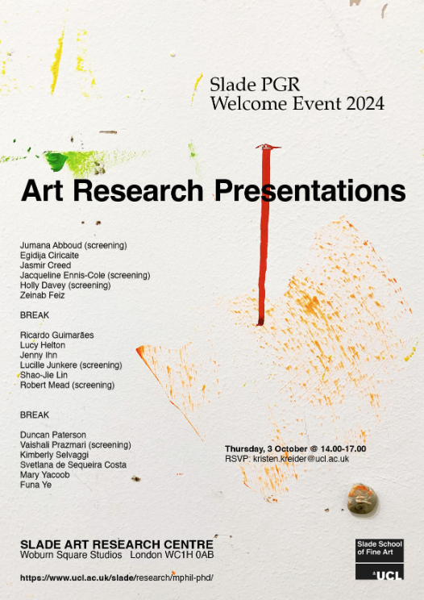

Another trip around the sun means we are now starting season 4 of Connected Environments. This is always a great time of year since you are starting afresh, introducing new ideas and meeting new people. Last week was induction week, this week was the first week of lectures and a couple of new PhD’s starting their journey. Particular nice was that we got to share a [Hot pot (I think the steam stone pot originates from Yunnan?)](https://en.wikipedia.org/wiki/Hot_pot) with current and new PhD's at [SKZO 食家莊](https://skzo.co.uk/about.html), just of Store Street. 

<!--more-->

The treasure hunt seemed to be as popular as ever and was great to see the Bloomsbury / East students mixing. 

The cohort this year seem very nice and chatty and have already been getting into the flow of work. This year we are investing a little more time on supporting them in their creative processes - this means Russell Davies "DO Interesting" book has been pulled out to give some guidance on [Noticing, Collecting, Sharing](https://www.iot.io/blog/2023/09/10/noticing.html)

The [Institute of Making (Stratford)](https://www.instituteofmaking.org.uk/blog/the-institute-of-making-stratford-opens-this-october) also opened their doors to us this week. Pretty much the whole team have been through the orientation so really looking forward to using this space this term (for non teaching related activities!). Just look how well organised their solder stations are! 

It was also lovely to visit the Slade Woburn Square studios for an afternoon of PhD presentations. A lovely studio space with natural lighting (is on top floor of building) and really interesting to see the variety of projects being worked on. The Slade PhD process is a little different to what I am used to so this will be an interesting journey with the lovely [Duncan Paterson](http://brothersjur.world) working on his "Auguries of the Marshes" and his primary supervisor [Winnie Soon](https://www.ucl.ac.uk/slade/people/academic/wsoon27/).

