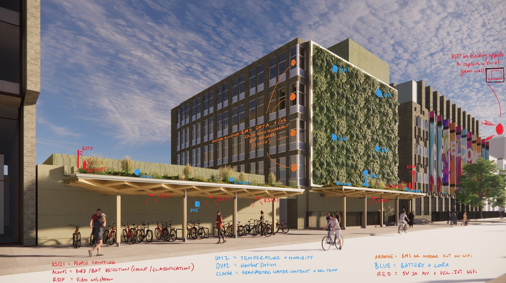

# Connected Environments Dissertation Project Ideas

Contact Duncan Wilson if you have ideas on how you could develop these projects.

## Park Life's a Pitch: [2026]
_Using Bioacoustic Signal Processing and Edge AI to Count Calls in QEOP_

We have been running 15 bat counters in the park since 2017. It is now time to replace the IoT devices. This project would be based on using the Acoupi framework on a RPi to enable the addition of monitoring bird activity through the day and continue counting bats through the night. Key components of the project will include: refining the RPi prototype ready for installation, installing the devices on lamp posts around the Olympic Park and creating a web site with new visualisations of the data for the community and visitors to the park. (A collaboration with Kate Jones at CBER)

## A Statistical Surge: [2026]
_Forecasting Flood Risk at House Mill on the Tidal Lea River_ 

We have multi year data of flood events at House Mill, a wooden listed building close to UCL East. This project involves using our CASA water height data with data from tide heights, localised rainfall, Thames barrier operation, phases of the moon etc to build up a picture of what contributes to flood events with the goal of establishing a day in advance that a flood event is likely to happen. This project will involve working with existing data sets, installing additional flood height sensors on the river Lea, using machine learning to analyse trends in data, testing forecasting algorithms on live events and developing mechanisms to feedback to volunteers in the building that a flood event is anticipated. (A collaboration with the volunteers at House Mill)

[Flood video](https://www.iot.io/blog/2024/06/21/housemill-video.html)

## A Sense of Place: [2026]
_Designing Interactive Data Experiences to Communicate Ecological Change by Green Infrastructure_

We are working with the UCL200 estates team who are constructing a new green wall and canopy on the brutalist concrete Chemistry building on Gordon Street in Bloomsbury. We are installing a variety of smart sensors to monitor the impact of the infrastructure on biodiversity and the use of the space. Sensors include microphones for bird and bat activity, cameras to observe the green roof, soil moisture sensors, urban heat island sensors, a weather station and people counters under the canopy. Whilst you will support the installation of the sensors, the major component of the project will be working with the data to create web and in situ visualisations that communicates the narrative behind the intervention and its impact on biodiversity in the city.

## From Ticket to Texture: [2026]
_Creating an Immersive and Intuitive Interface for Reporting Building Issues and Bridging Virtual Space with FM Workflows_

The building maintenance to do list is never ending. The goal of this project is to create the FM Holodeck, a delightful, virtual, customer centric help desk that enables building occupants to report and communicate issues they encounter. Using Gaussian splats or models of individual spaces at One Pool Street this project will create an interactive visual method of logging and visualising  issues requiring fixing. Key components of the project will include world building to develop the foundation model, creating novel forms of interaction to allow comments to be left in a 3D world and integration with existing facilities management systems to support exchange of data. (Valerio and Andy are also potential supervisors for this project)

## Room for Improvement: [2026]
_A Data-Driven Exploration of Space Utilisation, System Cost, and the Return on Insight of a Pop-Up IoT Network_

What can IoT data tell us about how a space is used. The goal of this project is to explore the value of IoT data through the analysis of data captured over a one year period in a pop up teaching space in Bloomsbury. Key components of the project could include a full life cycle cost analysis of the IoT system, case study analysis of the value of the data with facilities and space planning staff at UCL, validation of accuracy of the IoT data through in situ data sampling and exploring intangible value through feeding back to occupants information from the IoT system. 

[Grafana dashboard of the data](https://grafana.cetools.org/d/f63fb65d-bd04-4ef7-b65a-337876b359ab/trust2-ucl-portakabin?orgId=2&from=2024-09-16T00:59:56.554Z&to=2024-09-17T05:12:53.932Z&timezone=browser)

## The Bone-Shaker Index: [2026]
_An IoT Approach to Mapping Road Surface Integrity and Visualising the Rider Experience in Urban Environments_

Pot holes are often in the headlines for the damage they cause to road users. For cycle commuters they also present risk of accidents, loss of control and uncomfortable	 riding. This project aims to create a sensor unit that can be installed on a bike to map the quality of roads in London where “smoothness“ is an indicator of good. The project will involve building a geolocated IoT device, capturing data through volunteer riders and a website to visualise the data captured.  

## The Giant Robot's Handbook: [2026]
_Developing a Digital Twin and Real-Time Data Narrative to Reveal the Inner Workings of a UCL East Building_ 

Sensors are all around us, in our buildings and in our streets. This project will focus on exploring how we can make the invisible visible. Using our UCL East buildings as a living lab, this project will develop a virtual guide that allows students to “see inside the wall” to understand how the building works. Using digital twin technologies, real time data will be used to show how the building works to reveal the complexity of living inside a giant robot. Key components of this project will be creating the 3D environment in which to tell the story, developing narratives around how the building works through conversations with facilities managers, making use of real time data from the building and focusing on how to communicate the information as a novel building guide.

## Paddle, Probe, Protect [2026]
This project combines kayaking with environmental science to assess and protect river ecosystems. The focus is developing a sensor unit that can be used by citizen scientists with a kayak to capture data. Using geolocated sensors, this initiative enables monitoring of critical water quality indicators such as pH, turbidity, dissolved oxygen, and temperature. Paddling up the River Lea, it “probes” the water to detect pollution hotspots and maps river health, empowering communities and policymakers with actionable insights. The ultimate goal is to raise awareness, drive conservation efforts, and ensure that rivers remain vibrant ecosystems for future generations.

## Sonic Flora Underwater [2026]
This project focuses on decoding the sounds of aquatic plant growth. Submerged aquatic plants provide important food and habitat in freshwater systems but they are notoriously challenging to survey. Recent advances in bioacoustics suggest that submerged plants make detectable noises as they photosynthesise. Is it possible to use these noises to identify different species? Can they help to quantify plant biomass? What types of data could be collected using bioacoustics, and how could acoustic sensors be practically deployed to collect meaningful data? Initial experimentation in the pond in the Nature Smart Garden at OPS. (A collaboration with Izzy Bishop in CBER)

## At one with the building [2026]
A suspended VR experience driven by realtime data from the building. We have millions of zeros and ones that flow through our building representing the state of the space. In this project we want to explore how an immersive data experience that suspends our perception of reality where we float in a sea of data, suspended in space, can support alternative ways of experiencing that data. 

Past Project Ideas - kept for posterity

## At one with the building [2025] 
A suspended VR experience driven by realtime data from the building. We have millions of zeros and ones that flow through our building representing the state of the space. In this project we want to explore how sitting in a hammock, suspended in space, can support alternative ways of experiencing that data (e.g. flowing with the data, playing with the data, hearing the data...)

## Sonic Flora Underwater [2025]
This project focuses on decoding the sounds of aquatic plant growth. Submerged aquatic plants provide important food and habitat in freshwater systems but they are notoriously challenging to survey. Recent advances in bioacoustics suggest that submerged plants make detectable noises as they photosynthesise. Is it possible to use these noises to identify different species? Can they help to quantify plant biomass? What types of data could be collected using bioacoustics, and how could acoustic sensors be practically deployed to collect meaningful data? Initial experimentation in the pond in the Nature Smart Garden at OPS.
(A collaboration with Izzy Bishop in CBER)

## Geodesic LED Dome [2025]
We like NeoPixels and Geodesic domes - we are interested in creative ways that light and shape can communicate and engage. We have a 4m diameter geodesic dome with 1500 LED’s – how could this be used to create an interactive installation that tells a story about what is happening on the 1PS roof garden or as a building interface on the 3rd floor terrace or reception of the building? 

## Sun-Ray Seer [2025]
This project explores using IoT, a camera, and Optical Character Recognition (OCR) on an Arduino platform to develop a novel system for monitoring the energy output of a solar PV array. By integrating a camera with OCR capabilities, the system will automatically capture and interpret the readings displayed on the energy meter. This real-time data acquisition will be transmitted wirelessly through an IoT network, enabling remote monitoring and analysis of energy generation patterns. 

## Paddle, Probe, Protect [2025]
This project combines the kayaking with environmental science to assess and protect river ecosystems. By equipping a kayak with geolocated sensors, this initiative enables monitoring of critical water quality indicators such as pH, turbidity, dissolved oxygen, and temperature. Paddling up the River Lea, it "probes" the water to detect pollution hotspots and maps river health, empowering communities and policymakers with actionable insights. The ultimate goal is to raise awareness, drive conservation efforts, and ensure that rivers remain vibrant ecosystems for future generations. Paddle, probe, protect: science in motion. 

## Lido Thermal Pulse [2025]
This project aims to develop and deploy an IoT device to monitor pool water temperature at a local lido. By integrating this device into an IoT system, we will investigate the potential for energy savings through optimized pool heating strategies. Working closely with the local council and user groups, we will explore effective methods for communicating vital data and identifying user needs to ensure the system's successful implementation and long-term sustainability. 

## Building dashboard [2025]
Is it possible to visualise the health of a building? This project will utilise live data from the building (energy usage, environment data, occupancy) to communicate a narrative for the performance of the systems that control our built environment. We are particularly interested in ways of communicating this information to a general audience.

## Algal blooms [2025] 
Pollution in rivers from sewage and agriculture can lead to a buildup of algae that coats rocks and plants and can be harmful to wildlife. These algal blooms can be short-lived or persistent but are difficult to detect and predict. What types of sensors/systems could be used to detect and quantify algal blooms in real time?
(A collaboration with Izzy Bishop in CBER)

## When walls can talk [2025]
CASA have two locations at UCL East and Bloomsbury. The objective of this project would be to test an interactive installation to ask the research question: do staff engage with ambient devices that communicate activity across dislocated offices? "a nabztag for offices rather than divorcees"

## Smart walls [2025]
Build a reconfigurable work space that is parametric by design, can easily be manufactured in the LFW and supports sensing of space usage to allow for evaluation and adaption. Building on existing experimentation at Moorfields Eye Hospital (pop up eye clinics) this project would develop a reconfigurable and integrated space design system monitored using an iteration of the CE COACH sensor platform.

## Ambient portals [2024]
CASA have two locations at UCL East and Bloomsbury. The objective of this project would be to test an interactive installation to ask the research question: do staff engage with ambient devices that communicate activity across dislocated offices? "a nabztag for offices rather than divorcees"

## Building dashboard [2024]
Is it possible to visualise the health of a building? This project will utilise live data from the building (energy usage, environment data, occupancy) to communicate a narrative for the performance of the systems that control our built environment. We are particularly interested in ways of communicating this information to a general audience.

## Jump Buddy [2024]
A member of Pool Street staff is a potential future Olympic equestrian. We are keen to develop a device that can be worn by the rider to give either real-time performance information or post activity guidance to help improve performance. 

## Small acts of kindness [2024]
A cycle helmet / bib / bike lights that communicate messages of thanks to those who share the roadspace with cyclists. Control could be based on gestures / physical inputs that explore new forms of human computer interface.

## At one with the building [2024] 
A suspended VR experience driven by realtime data from the building. We have millions of zeros and ones that flow through our building representing the state of the space. In this project we want to explore how sitting in a hammock, suspended in space, can support alternative ways of experiencing that data (e.g. flowing with the data, playing with the data, hearing the data...)

## Smart walls [2024]
Build a reconfigurable work space that is parametric by design, can easily be manufactured in the LFW and supports sensing of space usage to allow for evaluation and adaption. Building on existing experimentation at Moorfields Eye Hospital (pop up eye clinics) this project would develop a reconfigurable and integrated space design system monitored using an iteration of the CE COACH sensor platform.

## Patient Journeys in a Pop Up eye clinic [2023]
CASA have been working with Moorfields Eye Hospital to explore the potential for the use of pop-up eye clinics in retail outlets (Brent Cross) to catch up on COVID appointment backlog. Time motion data (x,y data ever 10 seconds) from approximately 4000 patient journies and 4 different activity layouts are available. This project would explore different ways of analysing trends in patient throughput over time and space. Requires data visualisation to inform communication of trends and or data analysis to extract meaning from the data.

## Geodesic LED Dome [2023]
We have a 4m diameter geodesic dome with 1500 LED’s – how could this be used to create an interactive installation that tells a story about what is happening on the 1PS roof garden or as a building interface on the 3rd floor terrace.

## House Mill Flood Detection [2023]
Problem / Hypothesis: Alongside the Institute of Archeology at UCL we are working with volunteers at House Mill (https://housemill.org.uk) on the River Lea, a Grade 1 listed 18th century tidal mill. Their challenge is the Mill regularly floods causing damage to the wooden structure of the building.
Question: Would real-time continuous flood data help inform decision makers on approaches to alleviate the flooding.
Approach: Through the deployment of Lora based flood sensors and the installation of timeseries cameras to capture the ebb and flow of the water levels, a reporting tool will be developed to demonstrate data over at least a two month period over spring / summer 2023.

## Floating in the metaverse [2023]
Utilising 3D models of the Olympic Park area and the new UCL East buildings the goal of this project is to build a rig that would allow people to experience the sense of flying through our environment in VR. The focus of the project is to explore how movement of the body can be used to create a sense of floating when combined with the visual input of VR.

## RiverNet [2023]
This research project explores how IoT can be used as a tool for improving water quality and safety in rivers, with a particular focus on continuous monitoring using low cost connected sensors. To achieve this objective, an IoT platform will be deployed that includes sensors installed along the waterway which are able to monitor temperature, oxygen levels and other relevant parameters in real-time.

## QEOP water height monitoring [2023]
Water height in the waterways around the Queen Elizabeth Olympic Park provide risk indicators for managing assets in the area such as the community group managing the House Mill (https://goo.gl/maps/iH62ydGmeu5ZHdWm6). This project will utilise the Lora network deployed in the park to capture water height data over several months. The project will focus on deployment of IoT sensors plus gathering, processing and visualisation of data to help inform decision makers.  

## Internet of Things Dashboard [2023]
In Connected Environments we have a large number of IoT sensors and gateways deployed in the building, around the park and across London. This project will create a visual representation that is part art work / part digital dashboard to help staff and students understand the current status of devices. A secondary aim of the project is to create a reporting tool to allow for the better management of those services. 

## Counting People with mmWave sensors [2023]
Accurately detecting the presence of people while maintaining privacy of identity are the potential benefits of using mmWave sensor technology. This project will explore the development of a novel modular sensor unit that can be implemented to support understanding of space usage.

## EchoPiBox Passive Acoustic Monitor v2 [2022]
CASA have a number of bat monitors in the Queen Elizabeth Olympic Park that have been counting bat calls since 2017. In this research project we are interested in developing a v2 of the Bat Monitor. The project would focus on implementing a new device using AudioMoth as a sensor plus Raspberry Pi as host for deep learning models to classify bat calls. Knowledge of Edge Impulse and or TensorFlow Lite required. Whilst initial focus is on bats the device could also be used to detect bird calls (using Birdnet model).

## Space Usage Activity Monitoring in Bartlett Workshops. [2022]
Can Computer Vision help us understand how workshop spaces get used? The project would involve building a prototype camera that implements AI / ML techniques to anonymously track people in Bartlett workshops and visually represent activity trends over time. Dataset: open source image datasets would be used for training - project would create new datasets through inference on workshop usage. We have Oak 1 and Oak D cameras available for implementation.

## Face counting in lecture theatres [2022]
Project to develop a machine vision system to use object detection algorithms to anonymously count room occupancy in lecture theatres / offices. We have Oak 1 and Oak D cameras available for implementation.

## Office Activity [2022]
CASA have several IoT energy monitors on appliances in CASA measuring the coffee machine, kettle, water cooler, printers, screens etc. We are interested in analysis of this data from different perspectives: could time series analysis of this data help inform patterns of behaviour or help predict future activity? Could novel forms of visualisation help us see the data from a different perspective? Dataset: 8x energy monitors capturing power usage every 2 secs since December 2019.

## Virtual interfaces to data in the city [2022]
CASA have developed a walkshop web app called Smart Walks which has a database of geolocated technology in the city. The goal of this project would be to explore how this screen based application could be extended to incorporate novel forms of in-situ interaction and presentation of data in the urban environment. 

## Digital Fabric Design Fictions [2022]
CASA are working with the UCL East project team to develop an IoT Strategy to release the large volumes of data generated by modern buildings. Motivated by the technological concept of a smart campus but aware of the socio political risks, we are interested in developing some speculative futures to help frame how future scenarios of this campus of the future could play out. We are keen that the research explores potential futures through physical prototypes, design fictions or works of art. 

Dataset: documents on the vision for UCL East / planned programmes / data registers; sample datasets from existing building systems to build proof of concepts

## Photogram.AI [2022]
https://www.alice.camera 

The Alice Camera’s mission is to empower the next generation of content creators who have been let down by the lack of innovation and usability of traditional digital cameras. Photogram surveyed over 1,000 content creators and found that 89% wanted a device with the image quality of an interchangeable lens camera but with the connectivity of a smartphone.

By taking advantage of a new opportunity to bring together mirrorless camera technology, micro four thirds lenses and smartphone technology with the advances in computational photography and artificial intelligence, the team at Photogram are drastically rethinking the camera as a computer with an open source ecosystem making it easier to shoot, edit and share content seamlessly whilst being affordable and maintaining a professional optical system.

Project Brief: We are using Google's edge TPU in our camera so edge computing projects using deep learning and TFlite would be good. AR is also something we haven't fully explored. We don't have any preference on the specific technical application so we'd be open to suggestions.

## Solar PV Mapping Project [2022]
To estimate how much photovoltaic energy will be produced, we first need to know where the solar PV systems are. At the moment this is not well known in the UK for all but the largest solar PV systems - particularly domestic systems are poorly documented. This project would develop a methods for citizen scientists to monitor solar potential in their locale.

## Did the bats Lockdown? [2022]
CASA have a number of bat monitors in the Queen Elizabeth Olympic Park that have been counting bat calls since 2017. In this research project we are interested in exploring how to visualise changing calls volumes given environmental conditions (climate, events, seasons).

Dataset: available - approx 8 bat monitors (bat counts and probability of bat type), 1 weather station (usual weather parameters), event information (concerts, events etc)

www.naturesmartcities.com

## IoT Bike Lockers - Active Things [2022]

https://activethings.app

https://twitter.com/doactivethings/

We are working with Scott Cain (Honorary Senior Research Fellow) Founder and CEO of Active Things.  “Active Things is your Active Travel Assistant, helping you find and access (secure) bike parking, routes and more.”

The goal of this project is to identify and map the potential locations in London where cyclists may want to stop and secure their bike for 30 mins to 2 hours. With cycle theft on a continued upwards spiral there is a need for more secure urban parking for bikes. Active Things provide remotely accessible secure bike storage which you pay for by the minute. This is not aimed at storage at home or in the office (which are increasingly well catered for) but the intermediate journeys cyclists would like to make on their bikes – e.g. stopping at the pub for an hour on the way home, calling in at the gym, stopping to pick up some shopping etc. Research by Active Things indicates that risk of theft puts off many cyclists making these intermediate journeys and has a negative impact on cycle use (ie they don’t use the bike if they plan to go to the pub.

Research question: where should the first 1000 lockers be installed to best cater to these intermediate journeys? What kind of profile of use could be imagined in terms of daily usage patterns? Do the current deployments of bike racks match the need for secure parking?

Active Things are also interested in prototype smart lock systems that could be used with their existing cycle storage systems.

Data: Active Things are currently the provider of the TfL bike mapping service. They have expressed intent to share research findings from surveys interviews and feedback from users over the past year.
